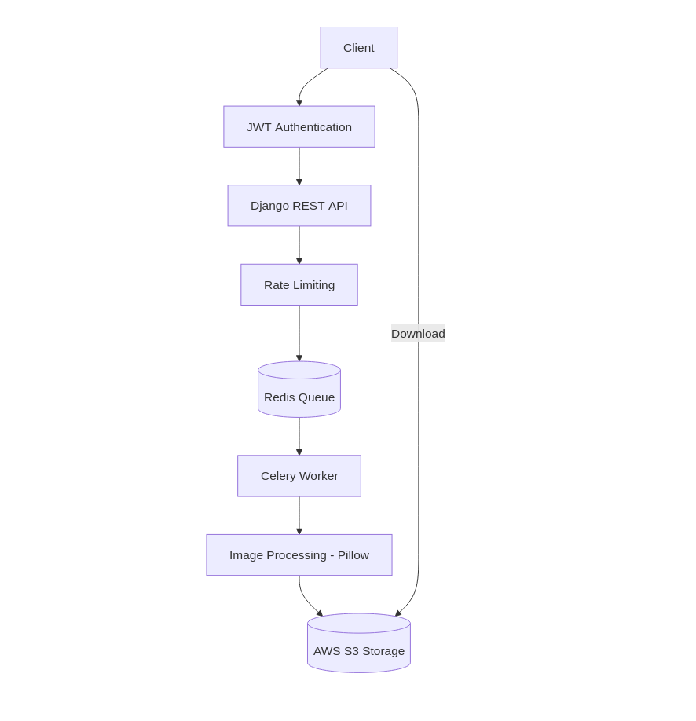

# ImageProAPI

**ImageProAPI** is a scalable image processing API that allows clients to upload images and apply multiple transformations through RESTful endpoints.

The API supports operations such as resizing, compression, format conversion, and filtering. Image processing tasks are handled asynchronously to ensure the API remains responsive even during heavy workloads.

Built with **Django and Django REST Framework**, ImageProAPI focuses on **performance, security, and scalability**, making it suitable for integration with web applications, mobile apps, or data processing pipelines.


---

## Features
- Image transformations using **Pillow**
  - Resize
  - Compression
  - Filters
  - Format conversion
- **Asynchronous image processing** using Celery workers
- **Redis-backed task queue**
- **AWS S3 storage** for media files and static assets
- **Dockerized environment** for consistent development and deployment
- **API rate limiting** to prevent abuse and improve service stability
- **JWT authentication** for secure API access
- **Automatic image cleanup** after expiry
- Modular API design suitable for integration into web or mobile applications
- API rate limiting implemented using Django REST Framework throttling

---

# Architecture Overview


The system is designed to prevent heavy image operations from blocking API requests.

1. Client uploads an image and specifies operations
2. API stores the image and operation instructions
3. A **Celery worker processes the image asynchronously**
4. A **Celery worker retrieves the task from Redis and processes the image**
5. The processed image is stored back in **S3**
6. Clients can retrieve the processing status and download the image
7. **Celery Beat schedules periodic cleanup tasks**

**Components**

- Django REST API
- Celery workers for background processing
- Redis as message broker
- AWS S3 for media and static files storage
- Docker for containerized development and deployment
- Pillow for image transformations

---

## Setup Instructions

1. Clone the repository:  
   ```bash
   git clone https://github.com/JhayceeCodes/ImageProAPI
   cd ImageProAPI 
   ```

2. Create and activate a virtual environment:
    ```bash
    python -m venv venv
    source venv/bin/activate  # Linux/macOS
    venv\Scripts\activate     # Windows
    ```

3. Install dependencies:
    ```bash
    pip install -r requirements.txt
    ```
4. Configure environment variables (if any, e.g., Redis URL, Django secret key).

5. Run migrations:
    ```bash
    python manage.py migrate
    ```
6. Start the development server
    ```bash
    python manage.py runserver
    ```

7. Start Celery worker (ensure Redis is running):
    ```bash
    celery -A config worker -l info
    ```

8. Start Celery beat (for scheduled tasks like auto-deletion):
    ```bash
    celery -A config beat -l info
    ```

## Running with Docker

To run the project using Docker:

```bash
docker-compose up --build
```

This will start:
- Django API
- Redis
- Celery Worker
- Celery Beat

Once running, the API will be available at:
```bash
http://localhost:8000
```

## API Endpoints
### Authentication
| Method | Endpoint                            | Description       |
| ------ | ----------------------------------- | ----------------- |
| POST   | `/accounts/register/`               | Register a new user   |
| POST   | `/accounts/login/`               | Login and obtain access & refresh token   |
| POST   | `/accounts/refresh/`                  | Refresh access token   |
| POST   | `/account/logout/`                  | Logout and blacklist refresh token  |

### Image Operations
| Method | Endpoint                            | Description       |
| ------ | ----------------------------------- | ----------------- |
| POST   | `/api/images/`               | Upload a new image with operations (as JSON).   |
| GET   | `/api/images/`               | List user images. |
| GET   | `/api/images/{id}/`               | Retrieve image details including status and download URL (if ready).   |
| GET   | `/api/images/{id}download/`                  | Download the processed image. Only available if status = completed.|


## Usage Flow

- Upload an image with processing operations.

- The API queues the request for background processing.

- A Celery worker processes the image.

- Client polls the image status endpoint.

- When processing is complete, a download link becomes available.


## Background Processing

- Image Processing: All image transformations are handled asynchronously by Celery workers to prevent blocking the API.

- Automatic Cleanup: Expired images are automatically deleted via a scheduled Celery task.

- Redis is used as the Celery broker.


## Technologies Used

- Python
- Django
- Django REST Framework
- Celery
- Redis
- Pillow
- Docker
- AWS S3


## Future Improvements

- Webhook support for processing completion
- Batch image processing
- API request analytics and usage metrics
- API key authentication and client access management


## License

This project is licensed under the MIT License.
